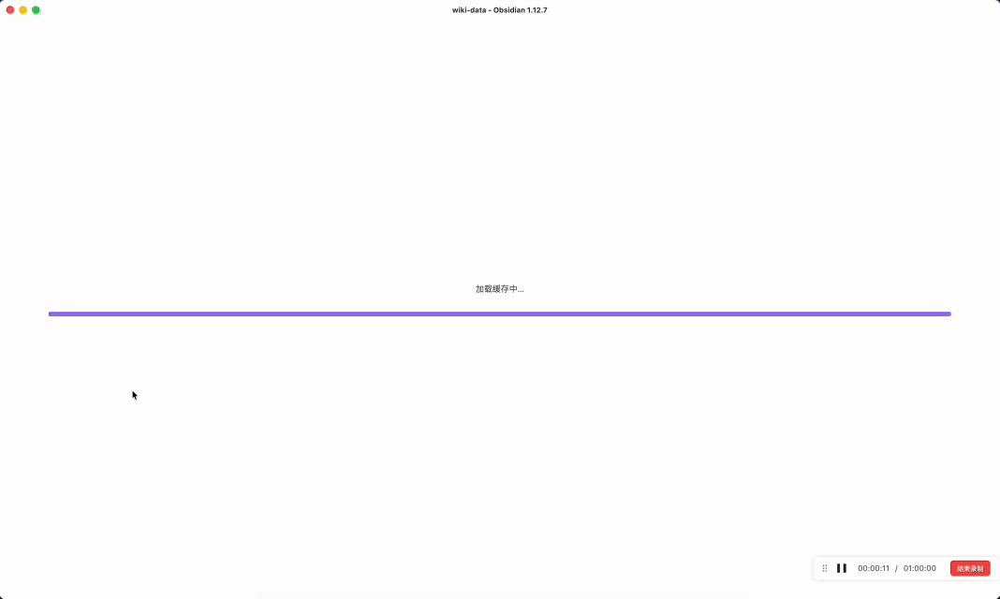

# pith-wiki

> 中文版 → [README.zh-CN.md](./README.zh-CN.md)

A terminal-native LLM wiki, Karpathy-style: don't shove raw documents into a
vector DB and pray. Hydrate them into dense Markdown entries, retrieve by keyword
+ link traversal. Local, file-based, works with any OpenAI-compatible LLM endpoint.




*Live dashboard: watching a notes folder, hydrating files into collections as they appear.*


*Drop a note into your Obsidian vault — pith-wiki auto-ingests it on the right.*

Current input formats: `.docx` `.eml` `.htm` `.html` `.markdown` `.md` `.pdf`
`.text` `.txt`.

> **Best practice**: point `watchDirs` at your Obsidian vault — every new
> document is automatically hydrated into an entry the LLM can pull from
> mid-conversation.

> **Design philosophy: data engineering > retrieval algorithms.** Don't dump raw
> docs into a store and hope embedding will pull them back. Use an LLM to
> _hydrate_ each source into a high-density Markdown entry, then retrieve by
> keyword + link traversal. Simple, file-based, human-readable.

**Platforms**: Linux and macOS, both covered by CI (Node 20 / 22). Windows is
theoretically usable but **not in CI** — `fs.rename` atomicity, chokidar
fs-events, `path.delimiter` all differ from POSIX. PRs welcome; not a launch
priority.

## Install

```bash
npm install -g pith-wiki
```

Then:

```bash
# Interactive one-shot setup — pick provider, paste API key, set a watch dir.
# All prompts are skippable; press Enter to accept defaults.
pith-wiki init

# Or non-interactive (for scripts / CI):
pith-wiki init --provider deepseek \
               --api-key sk-xxxxxxxxxxxxxxxx \
               --watch-dir ~/Obsidian \
               --no-prompt

# Enter the REPL
pith-wiki
```

`init` writes a minimal `~/.pith-wiki/.env` (single API-key line, `chmod 600`)
and — only if you picked a non-default provider or set a watch dir —
a minimal `~/.pith-wiki/config.json`.

> Five minutes from zero to first ingest → [docs/quickstart.md](docs/quickstart.md).

### Developers: build from source

Want to change code, contribute, or run `main`:

```bash
git clone https://github.com/l-zhi/pith-wiki.git
cd pith-wiki
npm install
npm run dev -- init      # tsx compiles + runs without `npm run build`
npm run dev              # launch REPL
```

Other dev scripts: `npm test` / `npm run typecheck` / `npm run lint` /
`npm run build` / `npm run release:check`.

For a side-by-side dev/prod setup (so production data isn't disturbed while you
iterate), see the `bin/pith-wiki-dev` shim and the `PITH_WIKI_HOME` env var.
Detailed contributor flow in [CONTRIBUTING.md](CONTRIBUTING.md).

## What it does

**1. Hydrate** — compress raw documents (markdown / PDF / DOCX / HTML / email)
into Markdown entries roughly 30% of the original size. Strip filler, keep
signal. LLMs read these directly.

**2. Retrieve** — no embeddings, no vector DB. Weighted keyword search (title × 2,
tags × 2, summary × 1, content × 0.5) + BFS link traversal. Boring on purpose.
Entries are plain Markdown; Obsidian, VS Code, and Git all open them natively.

**3. Chat** — the REPL agent talks to your library through 8 tools
(`read_file` / `write_file` / `list_dir` / `wiki_ingest` / `wiki_get` /
`wiki_query` / `wiki_list` / `wiki_read_source`). Every turn writes a transcript;
`/digest` distills the conversation back into a wiki entry, closing the loop
chat → store → retrieve.

**4. Auto-ingest** — configure `watchDirs` and changes in your notes folder
(Obsidian vault, inbox, etc.) are auto-enqueued. A background worker hydrates
them. `pith-wiki doctor` periodically checks library health (orphan links,
broken frontmatter, ID collisions).

## Command cheatsheet

| Command | One-liner |
|---|---|
| `pith-wiki init [--force] [--provider <id>] [--api-key <k>] [--watch-dir <p>] [--no-initial-scan] [--no-prompt]` | Interactive (or flagged) one-shot setup of `~/.pith-wiki/` |
| `pith-wiki` | Enter REPL (chat + auto worker + auto transcript) |
| `pith-wiki ingest --collection <c> --file <p>` | Hydrate a single file into the library |
| `pith-wiki ingest --collection <c> --dir <d>` | Recursively ingest a directory |
| `pith-wiki queue add\|status\|run\|retry\|clear` | Manage the persistent ingest queue |
| `pith-wiki watch` | Start the directory watcher (REPL does this automatically) |
| `pith-wiki get <id>` / `list` / `query "..."` | Retrieve (no LLM call needed) |
| `pith-wiki doctor [--json] [--check ...]` | Library health check (no LLM call needed) |
| `pith-wiki converters` / `status` | List converters / open the dashboard |
| `pith-wiki --help` | All subcommands |

Detailed flags, REPL slash commands, watcher / queue configuration:
[docs/usage.md](docs/usage.md).

## Full documentation

| Document | When to read it |
|---|---|
| [docs/quickstart.md](docs/quickstart.md) | Five-minute zero-to-first-ingest |
| [docs/usage.md](docs/usage.md) | All CLI commands, REPL, queue, watcher, doctor, multi-provider |
| [docs/repl-workflow.md](docs/repl-workflow.md) | Multi-terminal workflow, transcripts, `/digest`, daily routine |
| [docs/config.md](docs/config.md) | Configuration field reference, `additionalReadPaths`, on-disk layout |
| [docs/config.example.json](docs/config.example.json) | Full `~/.pith-wiki/config.json` example (multi-provider + watchDirs + queue) |
| [docs/entry-format.md](docs/entry-format.md) | YAML frontmatter spec for entries |
| [docs/architecture.md](docs/architecture.md) | Three core services + data-flow diagram |
| [docs/security-model.md](docs/security-model.md) | Sandbox invariants (required reading for contributors) |
| [docs/release.md](docs/release.md) | Release checklist + historical regressions |
| [docs/roadmap.md](docs/roadmap.md) | Likely next / maybe someday / explicit non-goals |
| [SECURITY.md](SECURITY.md) | Vulnerability reporting |
| [CONTRIBUTING.md](CONTRIBUTING.md) | Contribution flow |
| [CHANGELOG.md](CHANGELOG.md) | Version history |

## License

[MIT](LICENSE) · Copyright (c) 2026 lizhi
