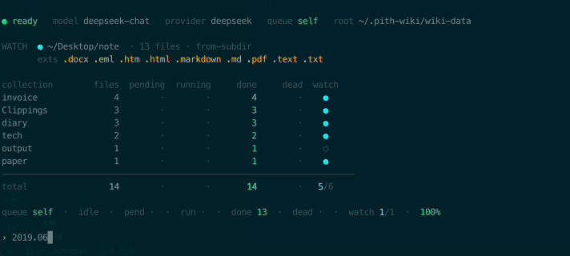
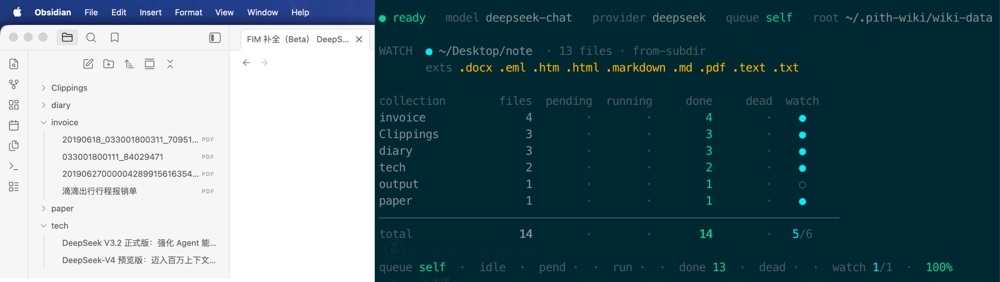

# pith-wiki

> English version → [README.md](./README.md)

一个 CLI 命令行工具，用于搭建 **Karpathy 风格** 的 LLM 知识库。
把电脑上任意目录 / 文件夹里的文档整理成可快速检索的知识库，跟大模型对话，
同时把对话本身脱水成新的文档输回库里。



*实时 dashboard：监听本地笔记目录，新增文件自动 hydrate 进各 collection。*



*往 Obsidian vault 里加笔记，右边 pith-wiki 立刻自动入库。*

目前支持：`.docx` `.eml` `.htm` `.html` `.markdown` `.md` `.pdf` `.text` `.txt`。

> **最佳实践**：把本地 Obsidian 目录配进 `watchDirs`——往 Obsidian 加任何文档都会
> 自动建索引，供大模型在对话时引用。

> **设计哲学：数据工程 > 检索算法。** 不要把原始文档塞进库里、再指望 embedding
> 把它捞回来。用 LLM 把原文 _脱水（hydrate）_ 成高密度的 Markdown 词条，
> 检索时靠关键词 + 链接遍历，简单直接，肉眼可读。

**平台支持**：Linux 与 macOS，CI 矩阵两个都跑（Node 20 / 22）。Windows
理论可用但**不在 CI 覆盖范围**——`fs.rename` 原子性、chokidar fs-event、`path.delimiter`
都跟 POSIX 不一样；社区 PR 欢迎，但首发不投入这部分工程量。

## 安装

```bash
npm install -g pith-wiki
```

然后：

```bash
# 交互式一键 setup——挑 provider、贴 API key、设 watch 目录。
# 任何步骤都可回车跳过，使用默认值。
pith-wiki init

# 或者非交互（脚本 / CI 场景）：
pith-wiki init --provider deepseek \
               --api-key sk-xxxxxxxxxxxxxxxx \
               --watch-dir ~/Obsidian \
               --no-prompt

# 进 REPL
pith-wiki
```

`init` 会写一个最小化的 `~/.pith-wiki/.env`（只放一行 API key，`chmod 600`）。
只有当你**选了非默认 provider**或者**设了 watch 目录**时，才会再写一份最小的
`~/.pith-wiki/config.json`。

> 5 分钟从 0 跑通第一条入库 → [docs/quickstart.zh-CN.md](docs/quickstart.zh-CN.md)。

### 开发者：从源码构建

想改代码 / 贡献 PR / 跑没发布的 main 分支：

```bash
git clone https://github.com/l-zhi/pith-wiki.git
cd pith-wiki
npm install
npm run dev -- init      # tsx 直接编译执行，免 build
npm run dev              # 跑 REPL
```

其它开发期脚本：`npm test` / `npm run typecheck` / `npm run lint` /
`npm run build` / `npm run release:check`。

想要 dev / prod 并存（不让生产数据被开发调试污染），见 `bin/pith-wiki-dev`
脚本和 `PITH_WIKI_HOME` 环境变量。详细贡献流程见
[CONTRIBUTING.md](CONTRIBUTING.md)。

## 这工具能干啥

**1. 脱水**（Hydrate）—— 把原始文档（markdown / PDF / DOCX / HTML / email）压缩成
~30% 大小的高密度词条，扔掉口水话和修饰词，只留信号。LLM 直接读得动。

**2. 检索**（Retrieve）—— 没 embedding、没向量库。关键词加权（title × 2、
tags × 2、summary × 1、content × 0.5）+ BFS 链接遍历，简单到不可能出错。
词条本身就是 markdown，Obsidian / VS Code / Git 都能直接用。

**3. 对话**（Chat）—— REPL agent 通过 8 个工具（read / write / list_dir +
wiki_ingest / wiki_get / wiki_query / wiki_list / wiki_read_source）跟你的库
聊天。每次回合自动写 transcript，`/digest` 把对话精华回灌成 wiki 条目，
形成 "聊 → 落库 → 下次能查到" 的反馈环。

**4. 自动入库**（Ingest）—— 配 `watchDirs` 之后，你的笔记目录（Obsidian vault /
inbox folder）有变动就自动入队，后台 worker 自动消化。`pith-wiki doctor` 定期
检查库的健康度（孤儿链接、坏 frontmatter、id 撞名）。

## 命令速览

| 命令 | 一句话 |
|---|---|
| `pith-wiki init [--force] [--provider <id>] [--api-key <k>] [--watch-dir <p>] [--no-initial-scan] [--no-prompt]` | 一次性初始化 `~/.pith-wiki/`（交互或带 flag） |
| `pith-wiki` | 进 REPL（chat + 自动 worker + 自动 transcript） |
| `pith-wiki ingest --collection <c> --file <p>` | 单文件脱水入库 |
| `pith-wiki ingest --collection <c> --dir <d>` | 目录批量入库 |
| `pith-wiki queue add\|status\|run\|retry\|clear` | 持久化队列管理 |
| `pith-wiki watch` | 启动目录监听（REPL 会自动起，单独跑也行） |
| `pith-wiki get <id>` / `list` / `query "..."` | 检索（不需要调用 LLM） |
| `pith-wiki doctor [--json] [--check ...]` | 库健康度体检（不需要调用 LLM） |
| `pith-wiki converters` / `status` | 列转换器 / 启动 dashboard |
| `pith-wiki --help` | 全部子命令 |

每条命令的详细 flag、REPL 内的 slash 命令、watcher / queue 配置见
[docs/usage.zh-CN.md](docs/usage.zh-CN.md)。

## 完整文档

| 文档 | 看这个的时机 |
|---|---|
| [docs/quickstart.zh-CN.md](docs/quickstart.zh-CN.md) | 5 分钟入门，从安装到第一条入库 |
| [docs/usage.zh-CN.md](docs/usage.zh-CN.md) | 详细 CLI 命令 + REPL + queue + watcher + doctor + 多 provider |
| [docs/repl-workflow.zh-CN.md](docs/repl-workflow.zh-CN.md) | 多终端协作、transcript、`/digest`、日常工作流 |
| [docs/config.zh-CN.md](docs/config.zh-CN.md) | 配置字段表、`additionalReadPaths`、文件落在哪 |
| [docs/config.example.json](docs/config.example.json) | 完整 `~/.pith-wiki/config.json` 示例（多 provider + watchDirs + queue） |
| [docs/entry-format.md](docs/entry-format.md) | 词条文件 YAML frontmatter 格式 |
| [docs/architecture.md](docs/architecture.md) | 三件套核心服务 + 数据流图 |
| [docs/security-model.md](docs/security-model.md) | 沙箱不变量（贡献者必读） |
| [docs/release.md](docs/release.md) | 发布清单 + 历史回归教训 |
| [docs/roadmap.md](docs/roadmap.md) | Likely next / Maybe someday / 明确不做 |
| [SECURITY.md](SECURITY.md) | 漏洞上报渠道 |
| [CONTRIBUTING.md](CONTRIBUTING.md) | 贡献流程 |
| [CHANGELOG.md](CHANGELOG.md) | 版本变更 |

## License

[MIT](LICENSE) · Copyright (c) 2026 lizhi
