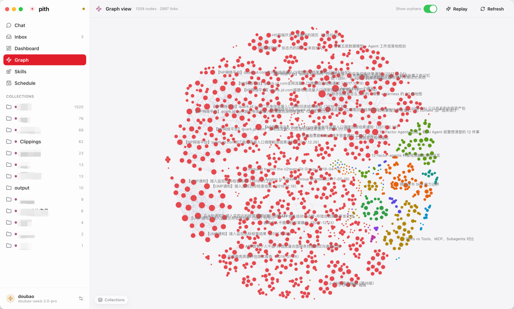

# pith-wiki

> English version → [README.md](./README.md)

**Karpathy 风格**的本地 LLM 知识库。把电脑上任意目录 / 文件夹里的文档整理成可快速
检索的知识库，跟大模型对话，同时把对话本身脱水成新的文档输回库里。兼容任意
OpenAI 协议的 LLM 端点——以**原生桌面应用**的方式运行。



*往 Obsidian vault 里加笔记，右边 pith-wiki 立刻自动入库，对话时即可被大模型引用。*

目前支持：`.docx` `.eml` `.htm` `.html` `.markdown` `.md` `.pdf` `.text` `.txt`。

> **最佳实践**：把本地 Obsidian 目录配进 `watchDirs`——往 Obsidian 加任何文档都会
> 自动建索引，供大模型在对话时引用。

> **设计哲学：数据工程 > 检索算法。** 不要把原始文档塞进库里、再指望 embedding
> 把它捞回来。用 LLM 把原文 _脱水（hydrate）_ 成高密度的 Markdown 词条，
> 检索时靠关键词 + 链接遍历，简单直接，肉眼可读。

**平台支持**：Linux 与 macOS，CI 矩阵两个都跑（Node 20 / 22）。Windows
理论可用但**不在 CI 覆盖范围**——`fs.rename` 原子性、chokidar fs-event、`path.delimiter`
都跟 POSIX 不一样；社区 PR 欢迎，但首发不投入这部分工程量。

## 运行应用

桌面应用（Electron）就是 pith 的使用方式——聊天、收件箱、仪表盘、关系图谱、技能，
以及带日历的**定时任务**视图，全部跑在同一套引擎和本地知识库之上。目前还没有打包好的
安装器，从源码跑：

```bash
git clone https://github.com/l-zhi/pith-wiki.git
cd pith-wiki/desktop
npm install
npm run dev      # electron-vite dev（HMR）
```

首次启动会有引导（onboarding）：挑 provider、贴 API key、指定一个要监听的笔记目录。
所有数据都在 `~/.pith-wiki/` 下（配置 + 知识库）；想要隔离的环境就设 `PITH_WIKI_HOME`。

开发期脚本：`npm test` / `npm run typecheck` / `npm run build`（在 `desktop/` 里跑，
或在仓库根跑引擎/核心层）。详细贡献流程见 [CONTRIBUTING.md](CONTRIBUTING.md)。

## 这工具能干啥

**1. 脱水**（Hydrate）—— 把原始文档（markdown / PDF / DOCX / HTML / email）压缩成
~30% 大小的高密度词条，扔掉口水话和修饰词，只留信号。LLM 直接读得动。

**2. 检索**（Retrieve）—— 没 embedding、没向量库。关键词加权（title × 2、
tags × 2、summary × 1、content × 0.5）+ BFS 链接遍历，外加精确子串/正则搜索
（`wiki_grep`）和日期区间过滤（按「入库时间」或「内容自身日期」）。简单到不可能
出错。词条本身就是 markdown，Obsidian / VS Code / Git 都能直接用。

**3. 对话**（Chat）—— agent 通过文件 + wiki 工具（`wiki_query` 模糊检索、
`wiki_grep` 精确搜索、`wiki_get`、`wiki_read_source`、`wiki_ingest`、
read/write/list_dir……）跟你的库聊天。每次回合自动写 transcript，`/digest` 把
对话精华回灌成 wiki 条目，形成 "聊 → 落库 → 下次能查到" 的反馈环。

**4. 自动入库**（Ingest）—— 在设置里指定要监听的笔记目录（Obsidian vault /
inbox folder），有变动就自动入队、后台 worker 自动消化。内置的健康检查会标出
孤儿链接、坏 frontmatter、id 撞名。

**5. 定时任务**（Schedule，*桌面端*）—— 设定到点跑一段 agent prompt 的任务
（一次性，或 cron）——比如每天汇总「昨天新增的内容」生成日报。每次触发新开一个
可回看的会话；`${yyyy-mm-dd -1}` 这类日期占位符在触发时解析成真实日期，「昨天」
永远算得对。

## 完整文档

| 文档 | 看这个的时机 |
|---|---|
| [docs/config.zh-CN.md](docs/config.zh-CN.md) | 配置字段表、`additionalReadPaths`、文件落在哪 |
| [docs/config.example.json](docs/config.example.json) | 完整 `~/.pith-wiki/config.json` 示例（多 provider + watchDirs + queue） |
| [docs/entry-format.md](docs/entry-format.md) | 词条文件 YAML frontmatter 格式 |
| [docs/architecture.md](docs/architecture.md) | 三件套核心服务 + 数据流图 |
| [docs/security-model.md](docs/security-model.md) | 沙箱不变量（贡献者必读） |
| [docs/usage.zh-CN.md](docs/usage.zh-CN.md) | CLI 参考（进阶 / 自动化——日常用以应用为主） |
| [SECURITY.md](SECURITY.md) | 漏洞上报渠道 |
| [CONTRIBUTING.md](CONTRIBUTING.md) | 贡献流程 |
| [CHANGELOG.md](CHANGELOG.md) | 版本变更 |

## License

[Apache 2.0](LICENSE) · Copyright (c) 2026 lizhi
